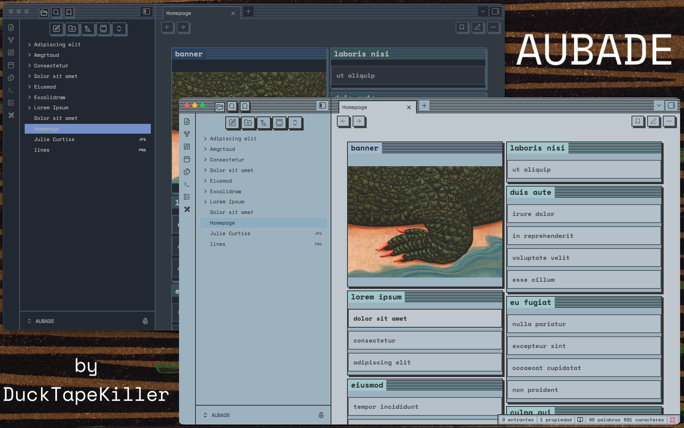
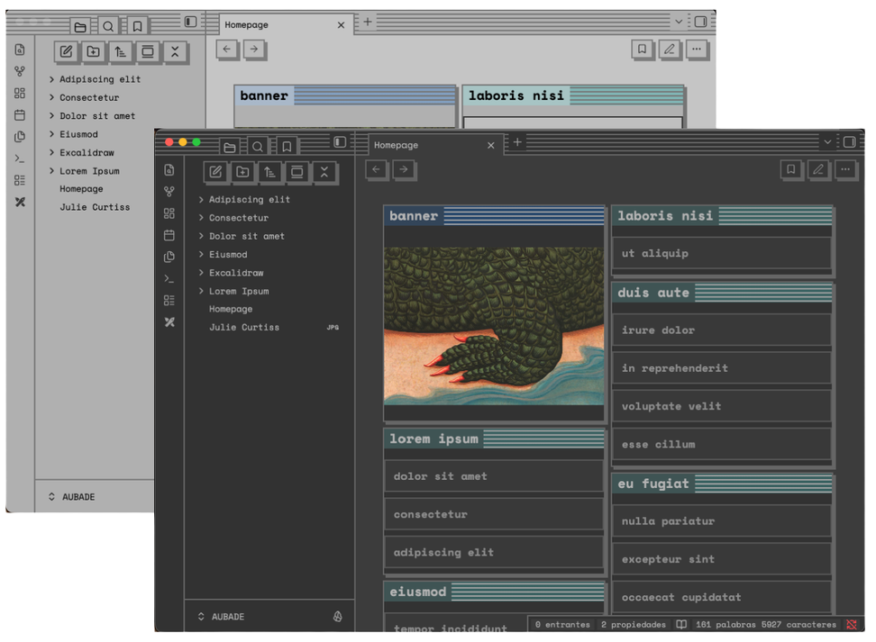
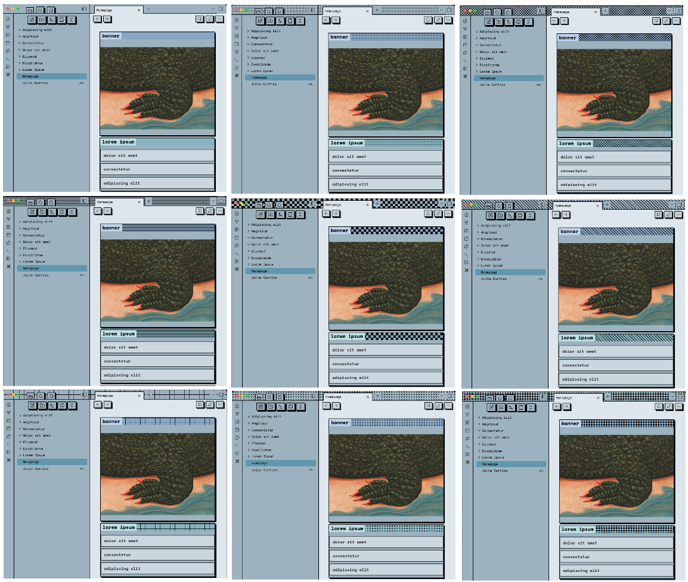
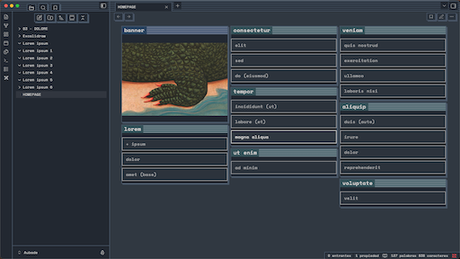
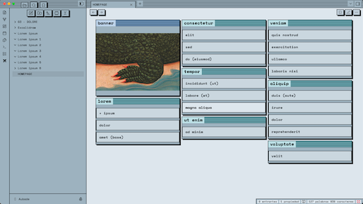

[](https://ko-fi.com/ducktapekiller)

**IMPORTANT:** This theme is under development. There are many aspects of the code which need work and functionalities that need refinements. Your support makes a huge difference.



**Aubade** is a retro-brutalist theme for [Obsidian](https://obsidian.md). It prioritises strict geometry, high contrast, and tactile interactions over soft gradients and rounded corners. Designed for users who require their digital workspace to feel like a structural tool.

## Visual Identity

* **Strict Geometry:** A zero-radius policy applied globally. Every corner is sharp; every container is a box.
* **Tactile Feedback:** Buttons and interactive elements feature hard, directional shadows (4px offset) that flatten physically when pressed.
* **High Contrast Borders:** 2px thick borders define every UI element, ensuring clear separation between panes, notes, and metadata.
* **Retro Typography:** Defaults to `Space Mono` for UI and `Azeret Mono` for text, reinforcing the terminal/typewriter aesthetic.

## Colour Schemes

| | |
|:---:|:---:|
| **Default**<br> | **Reader**<br> |
| **Ambar**<br> | **Solarised**<br> |
| **Midnight**<br> | **Sunset**<br> |
| **Ocean**<br> | **Forest**<br> |
| **Lavender**<br> | **Warm**<br> |
| **Cool**<br> | **Monochrome**<br> |
| **Brutalist**<br> | |

## Select your favourite pattern

**Patterns**<br>

## Key Features

* **Dashboard Ready:** Built-in grid support for dashboard layouts, automatically handling column breaks and gap spacing.
* **Mobile Optimised:** Features a custom bottom navigation bar, neutralised animations for better performance, and enlarged touch targets.
* **Nuclear Anti-Roundness:** Specific overrides ensure no plugin or native element introduces rounded corners.
* **Striped Headers:** Windows 95-style pinstripe gradients on window titles and tab containers.

## Typography

This theme contains the following typefaces:

### Sans Serif

* **iA Writer Quattro S** by Information Architects: [Source](https://github.com/iaolo/iA-Fonts)

### Monospace

* **Azeret Mono** by Displaay: [Source](https://fonts.google.com/specimen/Azeret+Mono)
* **Space Mono** by Colophon Foundry: [Source](https://fonts.google.com/specimen/Space+Mono)
* **Noto Sans Mono** by Google: [Source](https://fonts.google.com/noto/specimen/Noto+Sans+Mono)
* **iA Writer Duo S** by Information Architects: [Source](https://github.com/iaolo/iA-Fonts)
* **iA Writer Mono S** by Information Architects: [Source](https://github.com/iaolo/iA-Fonts)

**Clarification:** Typefaces are embedded within the theme, ensuring they are available offline and on any device without requiring local installation.

On Style settings, you can chose any of these fonts for either Body or UI and Headers.

## Layout & Configuration

You can fine-tune the reading experience in **Style Settings**.

### Alignment
Modify the text alignment of your notes using the dropdown menu:
* Left aligned (Default)
* Right aligned
* Centre aligned
* Justified

### Note Width Control
By default, notes are restricted to a readable width (800px). You can force specific global widths:
* 500px to 1000px
* Wide (1200px)
* Full Width (100%)

> **Note on Mobile:** These width constraints apply to **Desktop** only. On mobile devices, the theme ignores these classes and fits content to the screen width.

### Line Height & Titles
* **Line Height:** Adjust decimal line spacing between **1.0** and **3.0** (Default: 1.5).
* **Inline Title Size:** Adjust the size of the inline title between **1.0em** and **5.0em** (Default: 2em).

## Per-Note Overrides

Use the `cssclasses` property in your frontmatter (YAML) to override global settings for specific files.

### Custom Widths
Useful for notes containing wide tables or diagrams:
* `width-800`
* `width-900`
* `width-1000`
* `width-1200`
* `width-1600`

### Interface Hiding
To hide the frontmatter and note title for a specific note:
* `hide-all`

**Example:**
```yaml
---
cssclasses: width-1200, hide-all
---
```

## Dashboard & Masonry Layout

The theme allows you to organise your notes into a clean, visual grid. The system supports native **Obsidian Callouts** and automatically handles column distribution (2 columns by default, 3 on wide screens, 1 on mobile).

To activate, add `cssclasses: dashboard` to your note's frontmatter. Every Callout within that note will transform into a masonry card.

```markdown
---
cssclasses: dashboard
---

> - [[Link 1]]
> - [[Link 2]]
```

## Installation

### Method 1: Community Themes (CURRENTLY PENDING REVIEW BY OBSIDIAN)
1. Open **Settings** > **Appearance**.
2. Click **Manage** under Themes.
3. Search for **Aubade**.
4. Click **Install** and then **Use**.

### Method 2: Manual Installation
1. Download `theme.css` and `manifest.json` from the [Releases](../../releases) page.
2. Open your Obsidian vault folder.
3. Navigate to `.obsidian/themes`.
4. Create a new folder named `Aubade`.
5. Paste the files into this folder.
6. Reload Obsidian and select **Aubade** in **Settings > Appearance > Themes**.

## Gallery

### Dark Mode


### Light Mode

